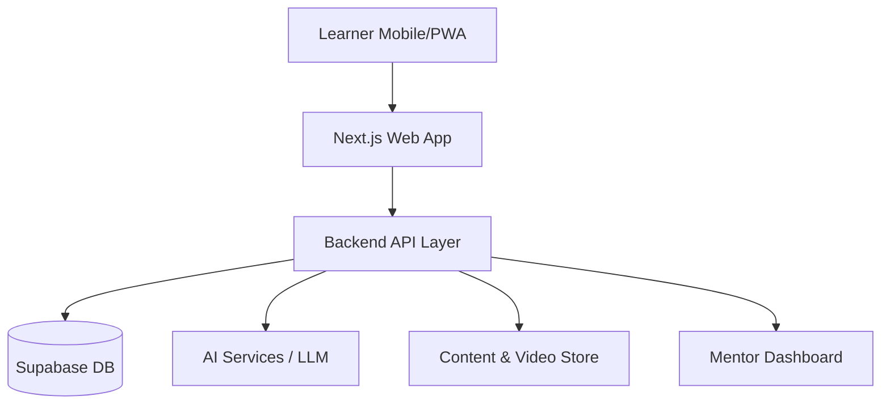

# MVP ARCHITECTURE DESIGN: AI-Powered Vernacular Exam Prep Platform

## 1. Principles
1. **Outcome-first, not feature-first**
2. **Manual > Automated** (v1)
3. **Replaceable components**
4. **WhatsApp-compatible workflows**
5. **Low burn, fast iteration**

## 2. High-Level System Architecture

## 3. Frontend (Learner-Facing)
- **Tech:** Next.js (PWA)
- **Core Screens:**
    1. Login / OTP
    2. Diagnostic Test
    3. Daily Study Plan
    4. Content Viewer
    5. Mock Test
    6. Progress Dashboard
- **Excluded:** Social feeds, Leaderboards, Gamification.

## 4. Backend Architecture
- **Stack:** Supabase (Auth, Postgres, Storage)
- **Services:**
    1. User Management
    2. Exam & Curriculum Engine
    3. Study Plan Engine
    4. Test & Scoring Engine
    5. Mentor Assignment Logic
    6. Payment (Razorpay)

## 5. Database Model (Simplified)
- **Tables:** `users`, `exams`, `topics`, `diagnostics`, `study_plans`, `content_items`, `mock_tests`, `test_attempts`, `mentors`, `subscriptions`
- **Rule:** Content maps to `exam` + `topic` + `difficulty` + `language`.

## 6. AI Layer (Lean)
- **Role:** Analyze diagnostic -> Generate Plan -> Suggest Remediation.
- **Stack:** OpenAI/Open Source LLM + DB Prompts + Rules Engine.
- **Logic:** `IF topic_accuracy < 60% THEN increase practice frequency`.

## 7. Content Delivery
- **Video:** Unlisted YouTube/Vimeo (Embedded).
- **Text:** PDFs/HTML (Vernacular-first).

## 8. Mentor Dashboard
- **Role:** Internal tool for tracking students, logging notes, scheduling.
- **Access:** Role-based (Next.js).

## 9. Communication
- **Primary:** WhatsApp / Telegram groups.
- **Use:** Reminders, Alerts, Motivation.

## 10. Deployment
- **Frontend:** Vercel
- **Backend:** Supabase Cloud
