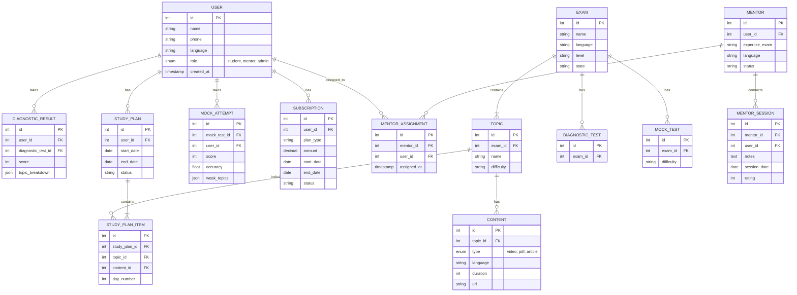

# DATA MODEL (ER DIAGRAM)

## Core Entities & Relationships

```mermaid
erDiagram
    USER ||--o{ DIAGNOSTIC_RESULT : takes
    USER ||--o{ STUDY_PLAN : has
    USER ||--o{ MOCK_ATTEMPT : takes
    USER ||--o{ SUBSCRIPTION : has
    USER ||--o{ MENTOR_ASSIGNMENT : assigned_to

    EXAM ||--|{ TOPIC : contains
    EXAM ||--o{ DIAGNOSTIC_TEST : has
    EXAM ||--o{ MOCK_TEST : has

    TOPIC ||--o{ CONTENT : has
    TOPIC ||--o{ STUDY_PLAN_ITEM : included_in

    STUDY_PLAN ||--|{ STUDY_PLAN_ITEM : contains
    
    MENTOR ||--o{ MENTOR_ASSIGNMENT : manages
    MENTOR ||--o{ MENTOR_SESSION : conducts
    
    USER {
        int id PK
        string name
        string phone
        string language
        enum role "student, mentor, admin"
        timestamp created_at
    }

    EXAM {
        int id PK
        string name
        string language
        string level
        string state
    }

    TOPIC {
        int id PK
        int exam_id FK
        string name
        string difficulty
    }

    CONTENT {
        int id PK
        int topic_id FK
        enum type "video, pdf, article"
        string language
        int duration
        string url
    }

    DIAGNOSTIC_TEST {
        int id PK
        int exam_id FK
    }

    DIAGNOSTIC_RESULT {
        int id PK
        int user_id FK
        int diagnostic_test_id FK
        int score
        json topic_breakdown
    }

    STUDY_PLAN {
        int id PK
        int user_id FK
        date start_date
        date end_date
        string status
    }

    STUDY_PLAN_ITEM {
        int id PK
        int study_plan_id FK
        int topic_id FK
        int content_id FK
        int day_number
    }

    MOCK_TEST {
        int id PK
        int exam_id FK
        string difficulty
    }

    MOCK_ATTEMPT {
        int id PK
        int mock_test_id FK
        int user_id FK
        int score
        float accuracy
        json weak_topics
    }

    MENTOR {
        int id PK
        int user_id FK
        string expertise_exam
        string language
        string status
    }

    MENTOR_ASSIGNMENT {
        int id PK
        int mentor_id FK
        int user_id FK
        timestamp assigned_at
    }

    MENTOR_SESSION {
        int id PK
        int mentor_id FK
        int user_id FK
        text notes
        date session_date
        int rating
    }

    SUBSCRIPTION {
        int id PK
        int user_id FK
        string plan_type
        decimal amount
        date start_date
        date end_date
        string status
    }
```

## Design Rule
Every learning action maps to: `Exam → Topic → Content → Score Outcome`.
